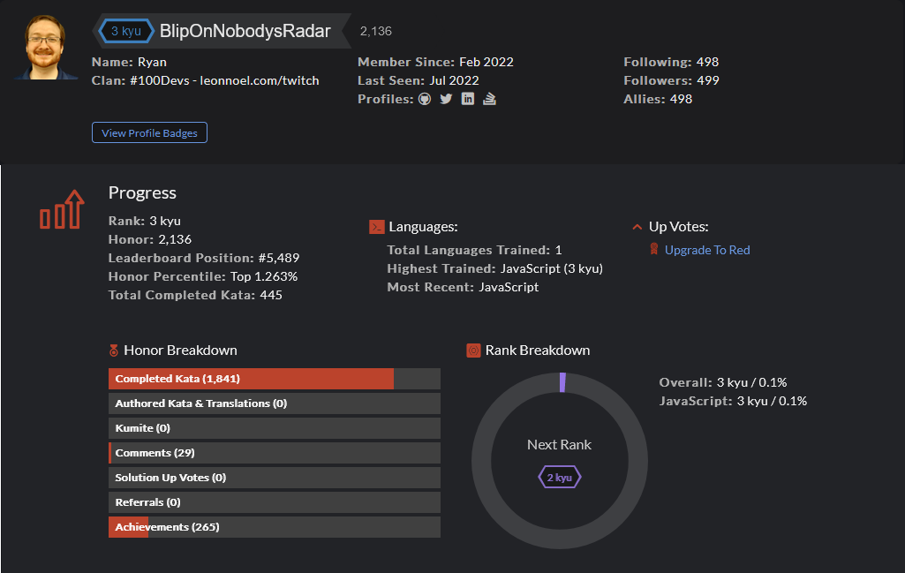

# CodeWars Challenges: <a target="_blank" href="https://www.codewars.com/users/BlipOnNobodysRadar" >Visit Here</a>

A repository filled with codewars challenges (kata). I'm currently in the top 1.4% of users with 445+ kata completed, and push atleast one solution every day.

## How It's Made:

**Tech used:** 

Every day, I warm up with a codewars kata and push the solutions here.

## Optimizations

I enjoy finding new and better ways to solve coding challenges, and so I commonly refactor my solutions with optimized code.
Optimizations may be for performance, for efficiency, or for readability.

## Lessons Learned:

There are so many lessons I have learned from these daily challenges, but if I had to pick some of the most important ones, it's these:

- Every problem can be broken down into solvable steps with code.
- Growth comes best through consistent effort.
- There's always more to learn.
